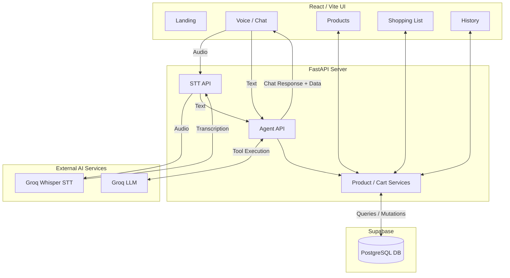
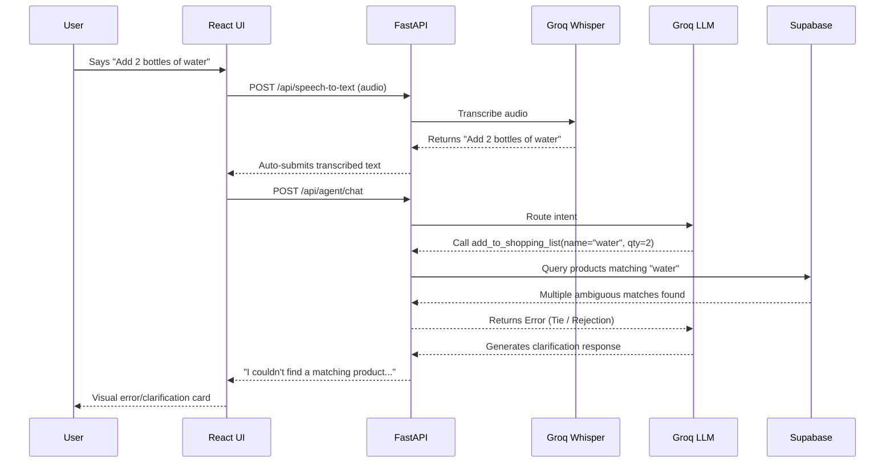
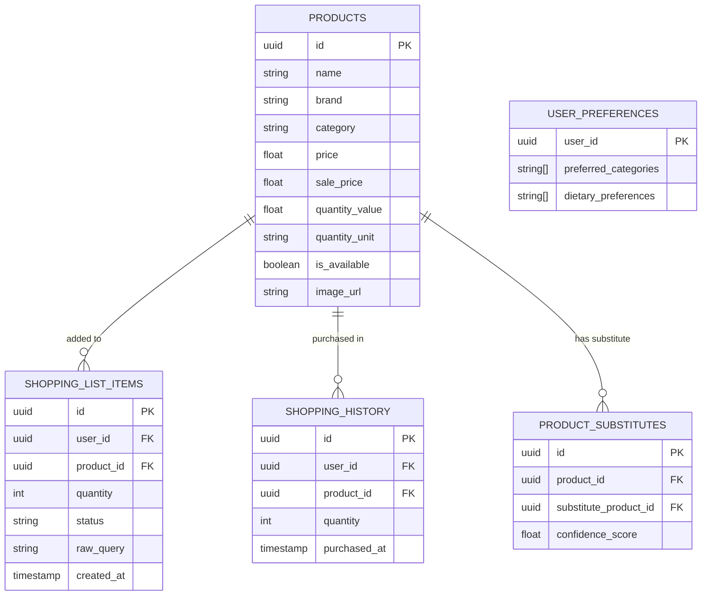

<div align="center">
  

  <h1>VERBALIST</h1>
  
  <p><strong>Voice Command Shopping Assistant</strong></p>

  <p>VERBALIST is a voice-based shopping assistant that understands natural-language commands to manage a shopping list, search products, and provide smart, context-aware suggestions.</p>
</div>
## Overview
Shopping applications often require users to manually navigate hierarchies, search bars, and filter menus just to build a simple cart. VERBALIST solves this by introducing a highly reliable voice-first interface. 

Users can speak naturally—e.g., *"Add two bottles of water"* or *"What organic snacks are on sale?"*—and VERBALIST will transcribe the speech, interpret the intent using a Large Language Model (LLM), deterministically resolve the requested products against a real catalog, and safely mutate the shopping list. 

VERBALIST supports both voice and text input. It accurately extracts quantities, handles complex filtering, offers substitutions, and ensures invalid products are gracefully rejected rather than silently added to the user's cart.

## Key Features

### Voice Input
- **Speech-to-Text Pipeline:** Uses Groq's Whisper API to transcribe audio captured directly from the browser microphone.
- **Natural-Language Understanding:** Converts conversational inputs into structured database operations (Add, Remove, Update, Search).
- **Type Instead:** Seamless fallback text-input mode that routes through the identical LLM processing engine.

### Shopping List Management
- **Add & Remove Products:** Precisely resolves products to their internal IDs before mutating the list.
- **Quantity Extraction:** Automatically parses quantities and units from natural language (e.g., "Add 5 apples").
- **Deterministic Resolution:** Strictly rejects ambiguous ties or nonexistent products to prevent hallucinations.
- **Cart-Aware Updates:** Safely modifies quantities or removes items only if they actually exist in the current active list.

### Voice-Activated Search
- **Natural Language Search:** Ask for "toothpaste under 500" or "organic fruits".
- **Dynamic Suggestions:** Real-time visual feedback of search results seamlessly injected into the chat UI.

### Smart Suggestions
- **Personalized Recommendations:** Built-in tools for the agent to fetch user-specific recommendations based on historical data.
- **Seasonal Products:** Tooling to identify and surface seasonal items dynamically.
- **Substitutes:** Identifies and suggests valid product substitutes via backend relationships.

### Multilingual Support
- **Multilingual Transcription:** Underlying Whisper architecture inherently supports diverse language transcription (e.g., Hindi/English commands) which the LLM translates into standard functional tool calls.

### User Interface
- **Landing Page:** Minimalist introduction to the application.
- **Home/Dashboard:** Quick snapshot of active cart metrics and navigation.
- **Voice Assistant:** The primary conversational interface with dual mic/typing modes and visual product cards.
- **Products:** Clean catalog view for traditional browsing and searching.
- **Shopping List:** Active cart management and list review.
- **History:** Chronological log of past checkouts and purchases.

## How It Works

VERBALIST operates on an Agent-Tool architecture. Rather than relying on rigid regex, an LLM dynamically selects backend tools based on the user's intent.

**End-to-End Flow:**
1. **User Input:** Audio is recorded via the browser and sent to the STT endpoint (or text is submitted directly).
2. **Transcription:** Groq Whisper transcribes the audio.
3. **Agent Router:** The transcribed text is sent to the FastAPI `agent/chat` endpoint.
4. **LLM Evaluation:** A Groq LLM evaluates the prompt, determining which tools to invoke (e.g., `add_to_shopping_list`).
5. **Deterministic Resolution:** The tool performs rigorous sub-token matching against the Supabase product catalog.
6. **Mutation:** If a valid product is found, the tool safely updates the `shopping_list_items` table.
7. **Response:** The LLM summarizes the action and returns data to the React UI for visual rendering.

## System Architecture



## Request / Processing Flow



## Database Schema



## Technology Stack

| Category | Technology |
|---|---|
| **Frontend** | React 19, TypeScript, Vite, Tailwind CSS 4, React Router |
| **Backend** | Python, FastAPI, Uvicorn, Pydantic |
| **AI / Agent** | Groq API (LLM) |
| **Speech / STT**| Groq Whisper API (`whisper-large-v3-turbo`) |
| **Database** | Supabase (PostgreSQL) |
| **Data Tools** | Jupyter Notebooks, Python Data Scripts |
| **Icons** | Lucide React |

## Project Structure

```text
VERBALIST/
├── backend/                  # FastAPI Application
│   ├── app/
│   │   ├── agent/            # LLM initialization and tool logic
│   │   ├── api/routers/      # HTTP endpoints (agent, stt, products, list)
│   │   ├── core/             # Configuration and environment setup
│   │   ├── db/               # Supabase database client configuration
│   │   ├── schemas/          # Pydantic models for validation
│   │   └── services/         # Business logic for database interaction
│   ├── scripts/              # DB seeding and image allocation scripts
│   └── tests/                # Pytest suites
├── frontend/                 # React Application
│   └── src/
│       ├── components/       # Reusable UI components (Sidebar, Navbar, Waveform)
│       ├── context/          # React Context (Auth, Shopping List Sync)
│       ├── pages/            # Page layouts (Voice, Products, List, etc.)
│       └── lib/              # Utilities and data mapping
├── data/                     # Raw and processed datasets, Jupyter notebooks
└── docs/                     # Project documentation
```

## Data Pipeline

To support realistic product resolution, VERBALIST ships with a comprehensive product data processing pipeline.


- **Cleaning:** Scripts in `data/notebooks/` sanitize categories, infer missing prices, parse raw quantity strings into discrete numbers/units, and remove dirty data.
- **Seeding:** `backend/scripts/seed_products.py` idempotently writes the cleaned catalog to Supabase.
- **Images:** `backend/scripts/update_images.py` assigns consistent, deterministic image URL placeholders for UI rendering.

## API Overview

### Agent & Voice
- `POST /api/agent/chat` - Processes natural language (text) through the LLM toolchain.
- `POST /api/speech-to-text` - Transcribes audio blobs into text using Whisper.

### Shopping List
- `GET /api/shopping-list` - Retrieves the active cart.
- `POST /api/shopping-list` - Safely creates a new cart item.
- `PATCH /api/shopping-list/{id}` - Mutates an existing item's quantity or status.
- `DELETE /api/shopping-list/{id}` - Removes an item from the cart.
- `POST /api/shopping-list/checkout` - Migrates active items to history.

### Products & History
- `GET /api/products` - Paginated product catalog.
- `GET /api/products/search` - Text-based product catalog search.
- `GET /api/shopping-history` - Retrieves past purchases.
- `GET /api/preferences` - Retrieves user dietary/brand preferences.

## Safety and Reliability

VERBALIST strictly enforces deterministic guardrails around LLM outputs:
- **No Hallucinated Carts:** The LLM is never allowed to invent `product_id`s. Tool execution strictly queries the database via sub-token matching before applying any mutations.
- **Tie-Breaker Rejection:** If a user requests a generic item (e.g., "Add water") and multiple matches occur, the system deterministically aborts the addition and requests clarification, preventing arbitrary guessing.
- **Context-Bound Updates:** The agent cannot modify or delete items that are not currently in the user's active shopping list context.
- **Rate Limiting:** Both the STT and LLM HTTP routers are equipped with fallback exception handling to catch `429` overloads and gracefully inform the user.

## Error Handling
- **Invalid Products:** If the LLM extracts a product name that doesn't exist, the backend tool rejects the operation, prompting the agent to naturally reply: *"I couldn't find a matching product for [Item]"*.
- **Speech Failures:** If audio is empty or Groq's STT fails, an explicit HTTP 400/500 is thrown and presented cleanly on the UI without breaking the application state.
- **Concurrent Processing:** The frontend UI explicitly disables voice toggles and text inputs while an API request is pending, preventing duplicated additions and race conditions.

## Screenshots

<!-- Add screenshot: Landing Page -->
<!-- Add screenshot: Voice Assistant -->
<!-- Add screenshot: Shopping List -->
<!-- Add screenshot: Product Search -->

## Deployment

### Frontend
`<FRONTEND_DEPLOYMENT_URL>`

### Backend API
`<BACKEND_DEPLOYMENT_URL>`

### API Documentation
`<API_DOCS_URL>`

## Environment Variables

**Backend (`backend/.env`):**
```env
SUPABASE_URL=
SUPABASE_ANON_KEY=
SUPABASE_SERVICE_ROLE_KEY=
GROQ_API_KEY=
GROQ_STT_MODEL=
```

**Frontend (`frontend/.env`):**
*(Any necessary Vite variables, e.g., `VITE_API_URL` if not defaulting to localhost)*

## Local Development

### 1. Clone the repository
```bash
git clone <REPOSITORY_URL>
cd VERBALIST
```

### 2. Backend Setup
```bash
cd backend
python -m venv venv

# Windows
venv\Scripts\activate
# macOS/Linux
source venv/bin/activate

pip install -r requirements.txt

# Copy environment variables and populate credentials
cp .env.example .env

# Run FastAPI server
uvicorn app.main:app --reload
```

### 3. Frontend Setup
```bash
cd frontend
npm install

# Start Vite dev server
npm run dev
```

### 4. Access the Application
- Frontend: `http://localhost:5173`
- Backend API: `http://localhost:8000`
- API Docs: `http://localhost:8000/docs`

## Testing

The backend includes a Pytest suite focusing on deterministic tool execution and STT validation.
```bash
cd backend
python -m pytest tests/
```

Static verification tests can be executed via:
```bash
# Python compilation check
python -m compileall backend/app

# TypeScript type-checking and build
cd frontend
npm run build
```

## Design Decisions
- **Agent-Tool Architecture:** Rather than having the UI parse natural language, the heavy lifting is delegated to a Python FastAPI backend acting as a Groq LLM tool-calling router. This isolates the complexity.
- **Database Mutability Guardrails:** Shopping-list mutations occur entirely inside isolated backend Python services. The LLM only provides the `(product_name, quantity)` extraction; the backend handles the definitive query mapping to prevent destructive database errors.
- **Supabase for Persistence:** Supabase PostgreSQL allows for scalable product querying and effortless integration of user-authenticated cart constraints via RLS (Row Level Security) if scaled.
- **Decoupled STT:** Separating transcription (Whisper) from generation (LLM Chat) enables modular replacement of the voice-recognition engine if a stronger/faster model emerges, without disrupting the core conversational state machine.

## Limitations
- **Catalog Dependence:** Product resolution is strictly confined to what is available in the seeded Supabase database. General queries for un-stocked items will be actively rejected.
- **Sub-Token Matching Constraints:** While deterministic matching is safe, it may sometimes require the user to be highly specific if the catalog contains hundreds of variations of a generic keyword.
- **Multilingual Efficacy:** While Whisper handles transcription beautifully across languages, the deterministic product resolution strictly matches English catalog entries. Hindi commands like "Mujhe doodh chahiye" require the LLM to successfully translate the intent to `add_to_shopping_list(product_name="milk")` internally.

## Future Improvements
- Implement vector/semantic search (pgvector) to replace the current sub-token deterministic product matching for much more flexible querying while maintaining safety.
- Expose robust personalized recommendations utilizing previous purchase history clusters.
- Add comprehensive Cypress/Playwright End-to-End browser tests.

## Submission / Project Links
- **Live Application:** `<FRONTEND_DEPLOYMENT_URL>`
- **Backend API:** `<BACKEND_DEPLOYMENT_URL>`
- **API Documentation:** `<API_DOCS_URL>`
- **GitHub Repository:** `<GITHUB_REPO_URL>`

## Author
Somiya Namdeo
