<div align="center">
  
  <h1>VERBALIST</h1>
  <p><strong>Voice Command Shopping Assistant</strong></p>
  <p>VERBALIST is a voice-based shopping assistant that understands natural-language commands to manage a shopping list, search products, and provide smart, context-aware suggestions.</p>
</div>

<div align="center">
  <a href="https://verbalist.vercel.app">[ Live Demo ]</a>
  <span> &nbsp; | &nbsp; </span>
  <a href="https://verbalist.onrender.com">[ Backend API ]</a>
  <span> &nbsp; | &nbsp; </span>
  <a href="https://github.com/somiya-namdeo/VERBALIST">[ GitHub ]</a>
</div>

<br />

## OVERVIEW

Shopping applications often require users to manually navigate hierarchies, search bars, and filter menus just to build a simple cart. VERBALIST solves this by introducing a highly reliable voice-first interface. 

Users can interact using natural-language speech or text. The system reliably parses intentions, determines required quantities, and strictly maps the request to a real, normalized product catalog. 

**Realistic Example Commands:**
* "Add two bottles of water"
* "Remove toothpaste from my cart"
* "Find organic apples"
* "What should I buy?"

## KEY FEATURES

| Feature | Description |
|---|---|
| **Voice Input & NLP** | High-accuracy Speech-to-Text via Groq's Whisper API using browser-native audio APIs. Parses raw sentences to identify actions (add, remove, update, search). |
| **Multilingual Voice Support** | Leverages Whisper's native multi-language transcription paired with backend catalog aliases for languages like Hindi. |
| **Shopping List Management** | Safely adds, updates quantities, and removes items specifically within the active cart context. Automatically handles quantity extraction (e.g., "Add 5 apples"). |
| **Automatic Categorization** | Items are automatically categorized (e.g., produce, dairy, snacks) based on the comprehensive product catalog metadata. |
| **Voice-Activated Search** | Searches the product catalog directly from natural-language descriptions. Includes robust filtering for brands, sizes, and price ranges (e.g., "Find toothpaste under $5"). |
| **Smart Suggestions** | Recommends products based on available purchase history and preferences. |
| **Seasonal Products** | Surrounds generic queries with seasonally appropriate alternatives. |
| **Product Substitutes** | Offers valid product alternatives via backend relationships if an exact match isn't ideal. |
| **UI/UX Optimization** | Features a minimalist interface with real-time visual feedback for voice commands. Built with a mobile/voice-first approach to maximize accessibility and speed. |
| **Text Input Fallback** | "Type Instead" functionality sharing the exact same intent processing pipeline as voice. |

## HOW IT WORKS

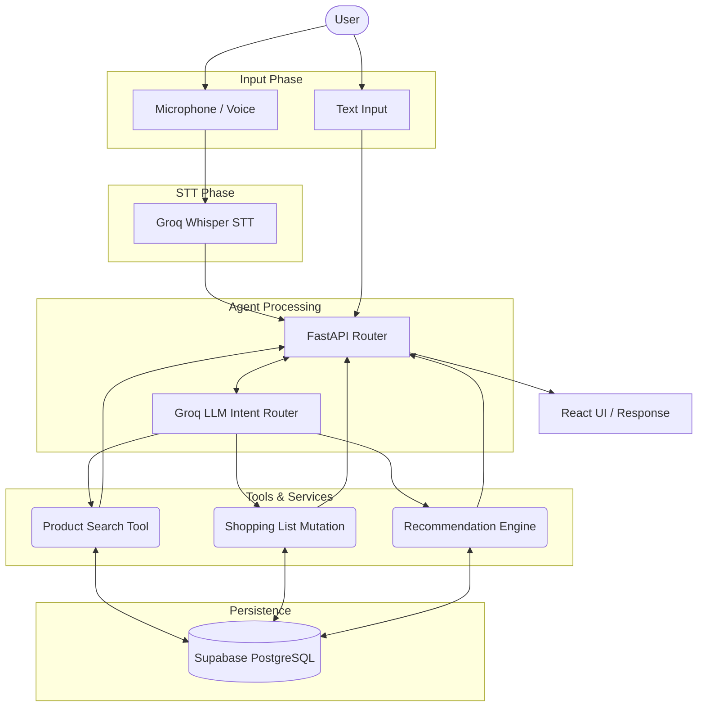

## SYSTEM ARCHITECTURE

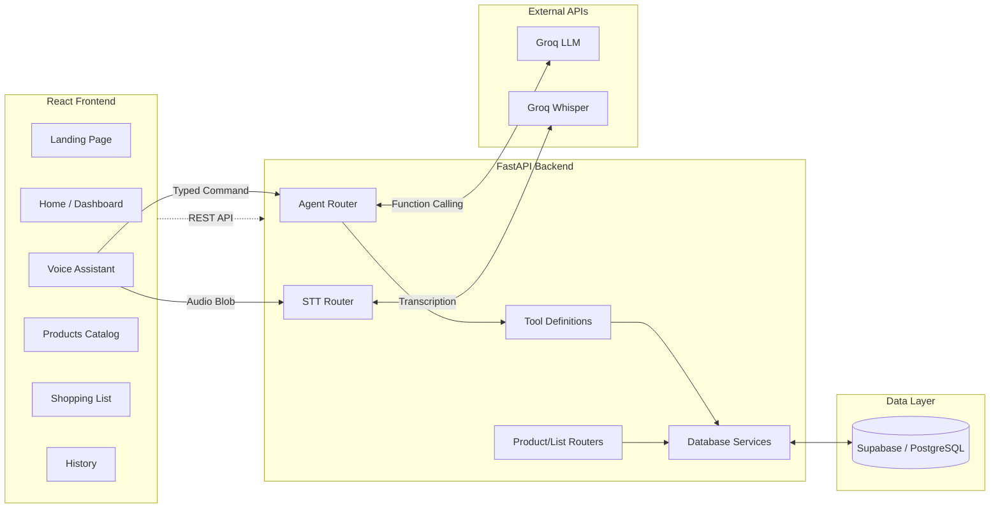

## DATABASE / SCHEMA

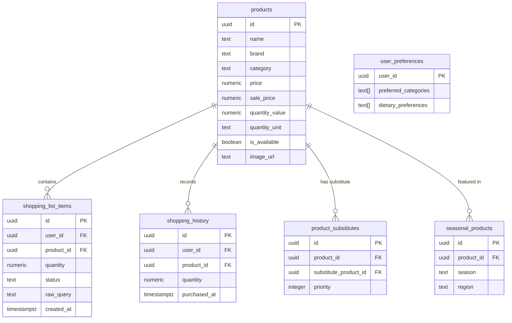

## TECHNOLOGY STACK

| Layer | Technologies |
|---|---|
| **Frontend** | React 19, TypeScript, Vite, Tailwind CSS 4, React Router, Lucide React |
| **Backend** | Python, FastAPI, Uvicorn, Pydantic |
| **AI / Voice** | Groq API (LLM Agent), Groq Whisper API (STT) |
| **Database** | Supabase (PostgreSQL), Row Level Security (RLS) |
| **Data Tooling** | Jupyter Notebooks (EDA/Cleaning), Python scripts (DB Seeding) |

## PROJECT STRUCTURE

```text
VERBALIST/
├── backend/                  # FastAPI Application
│   ├── app/
│   │   ├── agent/            # LLM tools, resolution logic, and groq integration
│   │   ├── api/routers/      # HTTP endpoints for agent, STT, products, and lists
│   │   ├── core/             # Environment configuration
│   │   ├── db/               # Supabase database client
│   │   ├── schemas/          # Pydantic models for request/response validation
│   │   └── services/         # Database transaction wrappers
│   ├── migrations/           # SQL schema files (Initial schema, RLS policies)
│   ├── scripts/              # Database seeding and image-placeholder scripts
│   └── tests/                # Pytest validations for agent/STT/tools
├── frontend/                 # React Application
│   └── src/
│       ├── components/       # Reusable components (Navbar, Sidebar, Waveform)
│       ├── context/          # React Context (AppContext for global state)
│       └── pages/            # View layer (Voice.tsx, Products.tsx, etc.)
├── data/                     # Raw/processed product CSVs and Jupyter notebooks
└── docs/                     # Additional project documentation
```

## ENGINEERING APPROACH

*   **LLM-Driven Intent Handling:** Rather than using rigid regex matching, an LLM handles natural language understanding to dynamically select backend tools, allowing for conversational variations.
*   **Deterministic Product Resolution:** To prevent LLM hallucinations from corrupting the database, the LLM extracts search tokens (e.g., name, quantity). The backend then performs a strict subset query against the real Supabase catalog. Ambiguous ties or missing products are safely rejected and clarified with the user.
*   **Safe Shopping List Mutations:** Updating or removing an item strictly checks the active user's cart context. This prevents a command like "Remove apples" from unintentionally altering historical or unrelated records.
*   **Shared Processing Path:** Typed commands are routed through the identical FastAPI intent processing chain as STT outputs, guaranteeing 1:1 behavioral parity regardless of input modality.
*   **Decoupled Architecture:** Supabase RLS secures user data, FastAPI strictly manages database mutation boundaries, and the React frontend acts solely as a stateless presentation layer.

## SCREENSHOTS

<div align="center">
  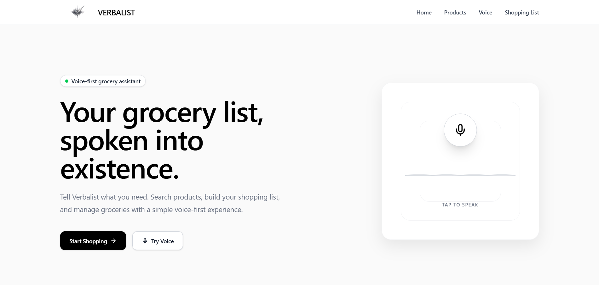
  <p><em>Landing Page</em></p>

  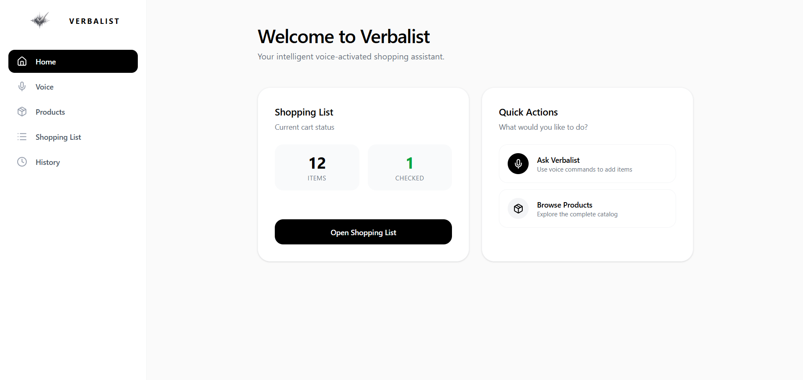
  <p><em>Home Dashboard</em></p>

  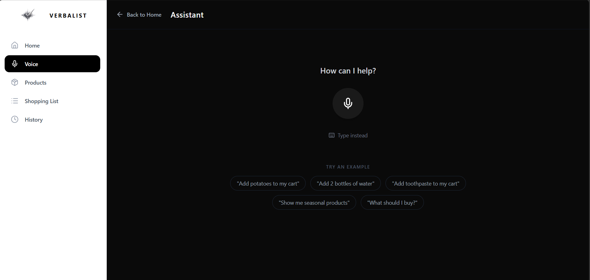
  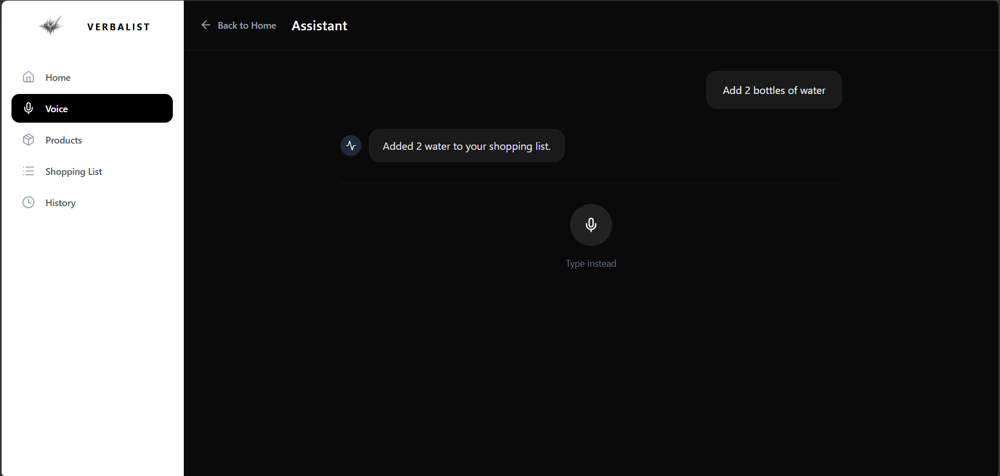
  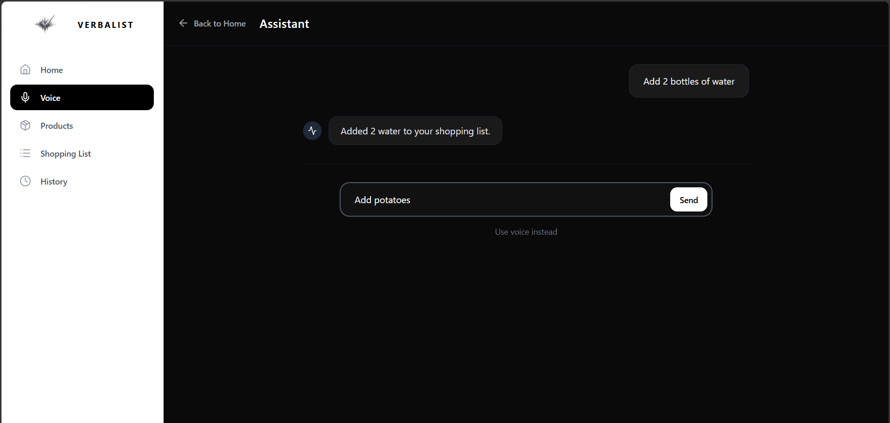
  <p><em>Real-Time Voice Assistant & Visual Feedback</em></p>

  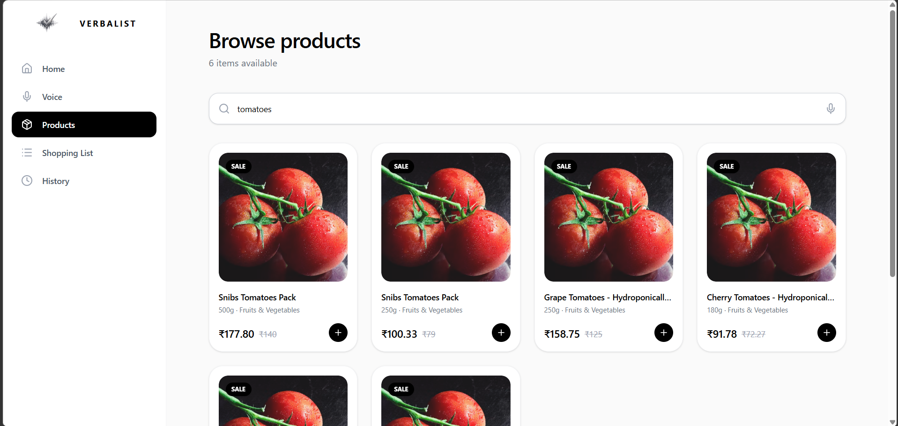
  <p><em>Product Catalog & Search</em></p>

  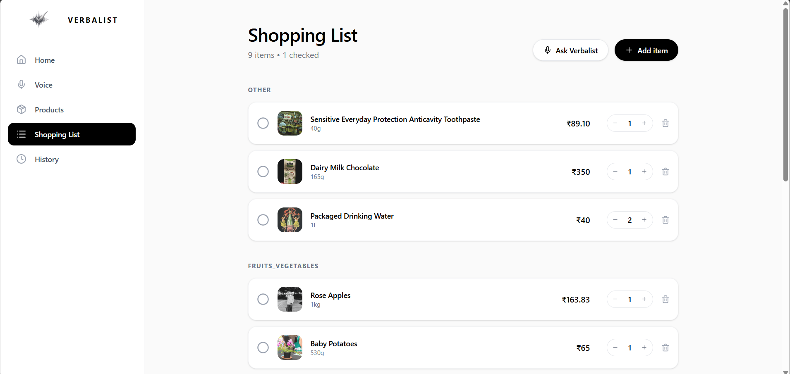
  <p><em>Active Shopping List with Categorization</em></p>
  
  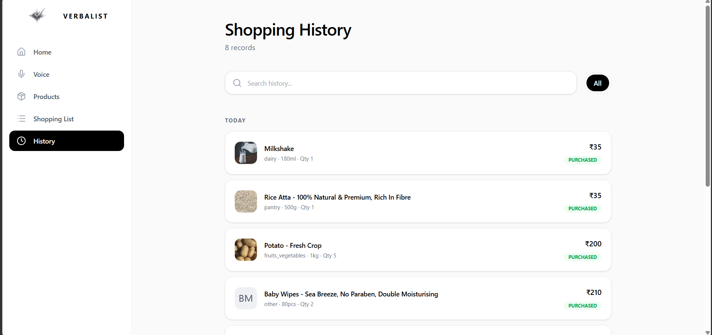
  <p><em>Purchase History</em></p>
</div>

## DEPLOYMENT

*   **Frontend URL:** `https://verbalist.vercel.app`
*   **Backend API URL:** `https://verbalist.onrender.com`
*   **API Docs:** `https://verbalist.onrender.com/docs`

## LOCAL DEVELOPMENT

### 1. Clone the repository
```bash
git clone https://github.com/somiya-namdeo/VERBALIST
cd VERBALIST
```

### 2. Backend Setup
```bash
cd backend
python -m venv venv

# Windows
venv\Scripts\activate
# macOS/Linux
source venv/bin/activate

pip install -r requirements.txt
```
Create a `.env` file from the example and provide your keys:
```bash
cp .env.example .env
```
Run the FastAPI development server:
```bash
uvicorn app.main:app --reload
```

### 3. Frontend Setup
```bash
cd frontend
npm install
npm run dev
```

## ENVIRONMENT VARIABLES

**Backend (`backend/.env`):**
```env
SUPABASE_URL=
SUPABASE_ANON_KEY=
SUPABASE_SERVICE_ROLE_KEY=
GROQ_API_KEY=
GROQ_STT_MODEL=
```

## TESTING / VALIDATION

Static compilation and build tests are used to validate the project infrastructure.

**Backend Compilation:**
```bash
cd backend
python -m compileall app
```

**Frontend Build:**
```bash
cd frontend
npm run build
```

**Unit Tests:**
```bash
cd backend
python -m pytest tests/
```

## PROJECT STORY
VERBALIST was built to rethink the standard e-commerce experience. Rather than forcing users to tap through deep category trees or type out every item in a search bar, this project explores how generative AI and natural language processing can unify the cart-building process. By integrating high-speed audio transcription with deterministic backend resolution, the system allows shoppers to effortlessly speak their needs exactly as they think of them—creating a seamless, accessible, and fast shopping experience.

## FUTURE IMPROVEMENTS
*   **Semantic Vector Search:** Implement PostgreSQL `pgvector` for looser semantic matching when exact string matches fail.
*   **Expanded Test Coverage:** Introduce Playwright E2E browser testing for the voice workflow.
*   **Cross-Session Analytics:** Improve recommendations by aggregating long-term user purchase trends securely.
